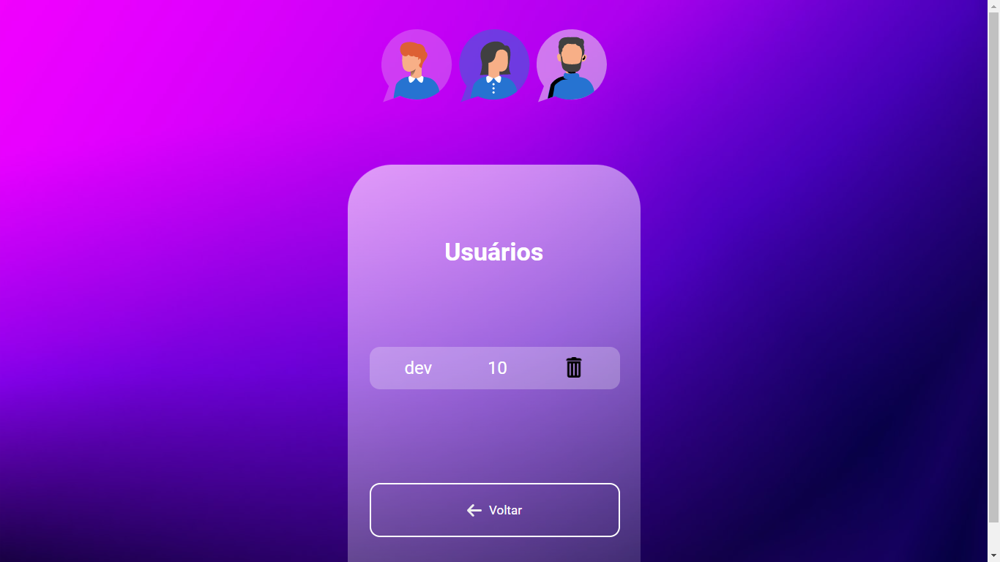
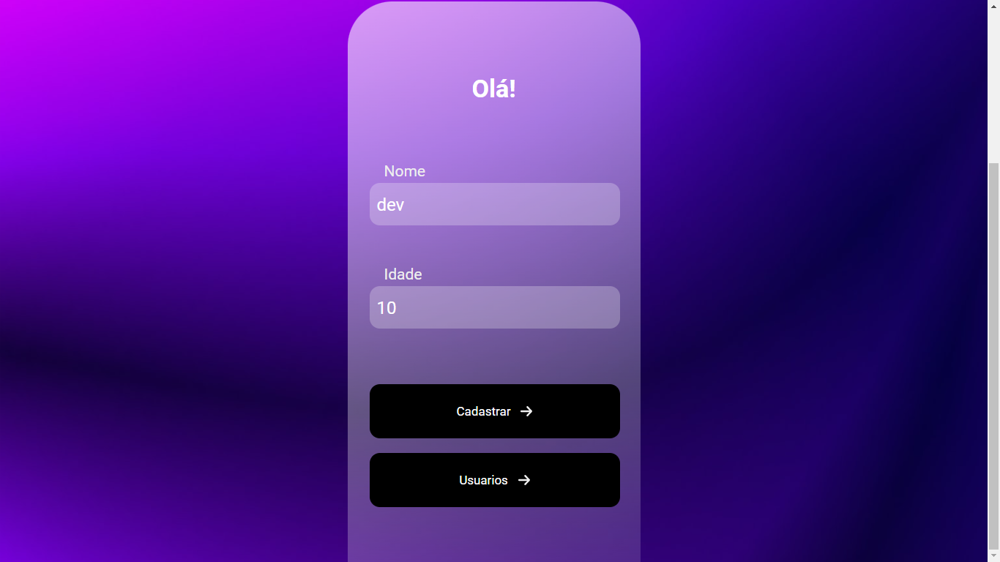

# Desafio-DevClub-Node-2
Desafio Final do Modulo Node.JS

🚀 Sobre o desafio
Crie uma aplicação que fará o cadastro dos pedidos de uma hamburgueria, e você deve utilizar Node e Express.

Rotas
POST /order: A rota deve receber o pedido do cliente, o nome do cliente e o valor do pedido, essas informações devem ser passadas dentro do corpo(body) da requisição, e com essas informações você deve registrar o novo pedido dentro de um array no seguinte formato: { id: "ac3ebf68-e0ad-4c1d-9822-ff1b849589a8", order: "X- Salada, 2 batatas grandes, 1 coca-cola", clientName:"José", price: 44.50, status:"Em preparação" }. Não se esqueça que o ID deve ser gerado por você, dentro do código utilizando UUID V4, assim que o pedido é criado, você deve sempre colocar o status como "Em preparação".

GET /order: Rota que lista todos os pedidos já feitos.

PUT /order/:id: Essa rota deve alterar um pedido já feito. Pode alterar,um ou todos os dados do pedido.O id do pedido deve ser enviado nos parâmetros da rota.

DELETE /order/:id: Essa rota deve deletar um pedido já feito com o id enviado nos parâmetros da rota.

GET /order/:id: Essa rota recebe o id nos parâmetros e deve retornar um pedido específico.

PATCH /order/:id: Essa rota recebe o id nos parâmetros e assim que ela for chamada, deve alterar o status do pedido recebido pelo id para "Pronto".

